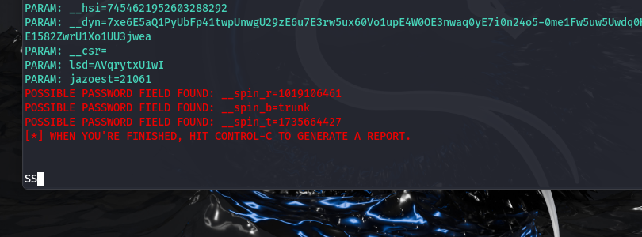

# Phishing para captura de senhas do Facebook

### Ferramentas

- Kali Linux
- setoolkit

### Configurando o Phishing no Kali Linux

- Acesso root: ``` sudo su ```
- Iniciando o setoolkit: ``` setoolkit ```
- Tipo de ataque: ``` Social-Engineering Attacks ```
- Vetor de ataque: ``` Web Site Attack Vectors ```
- Método de ataque: ```Credential Harvester Attack Method ```
- Método de ataque: ``` Site Cloner ```
- Obtendo o endereço da máquina: ``` ifconfig ```
- URL para clone: http://www.facebook.com

### Resultados




### O que pode ter dado errado

Talvez porque eu acessei do próprio Kali, ou por causa da instalação, aconteceu algumas coisas erradas e eu tive que instalar pelo boot do Vbox, demorou muito e eu só fui dando enter, creio que isso pode ter feito alguma coisa dar errado.
